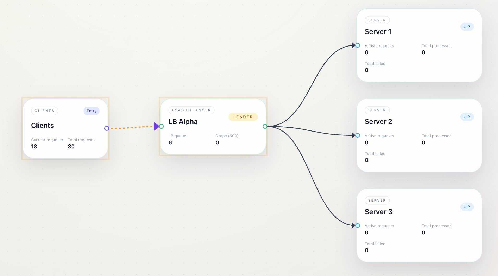

# Load Balancer Scenario Lab



An educational load balancer simulator built with Next.js. The app presents scenario-based lessons that explain how different load-balancing strategies behave under varying conditions. Each scenario is a scripted walkthrough with a topology diagram (clients → load balancer → servers), step-by-step narration, and clear takeaways.

## What This Teaches

- How different algorithms route traffic (Round Robin, Weighted RR, etc.)
- When a strategy works well and where it fails
- How slow nodes or uneven capacity affect outcomes

## Product Experience

- Scenario list on the left
- System design diagram on the canvas
- Step-by-step narration placed near the relevant node or edge
- Manual Next/Prev navigation (no auto-advance)
- Scenario intro modal before each walkthrough


## Quick Start

```bash
npm install
npm run dev
```

Open `http://localhost:3000` in your browser.

## Project Structure

- `app/home-client.tsx` – UI, canvas, callouts, and scenario flow
- `lib/scenario-learning.ts` – Scenario definitions and scripted steps

## Adding a Scenario

1. Open `lib/scenario-learning.ts`.
2. Add a new object in the `scenarios` array.
3. Define:
   - `base` topology (clients, LBs, servers)
   - `steps` with `highlightNodeIds`, `highlightEdgeIds`, and scripted stats

Example step:

```ts
{
  id: "example-step",
  title: "Routing begins",
  text: "Requests are routed to the least busy server.",
  highlightEdgeIds: ["edge-lb-1-srv-2"],
  stats: {
    servers: { "srv-2": { active: 6, processed: 10 } },
  },
}
```

## Design Notes

The simulator is intentionally deterministic and scripted. It prioritizes clarity and explanation over real-time simulation or stochastic behavior.

## License

MIT
